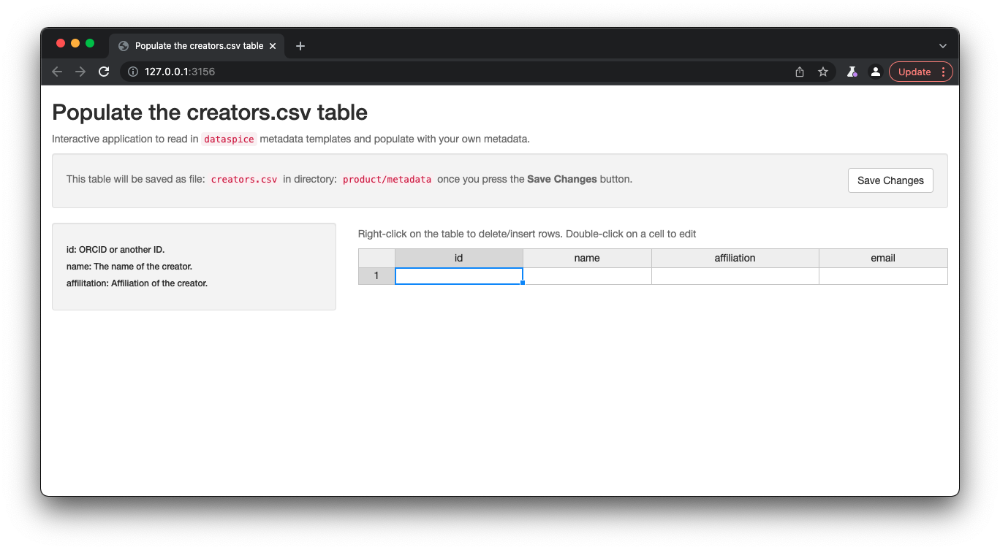
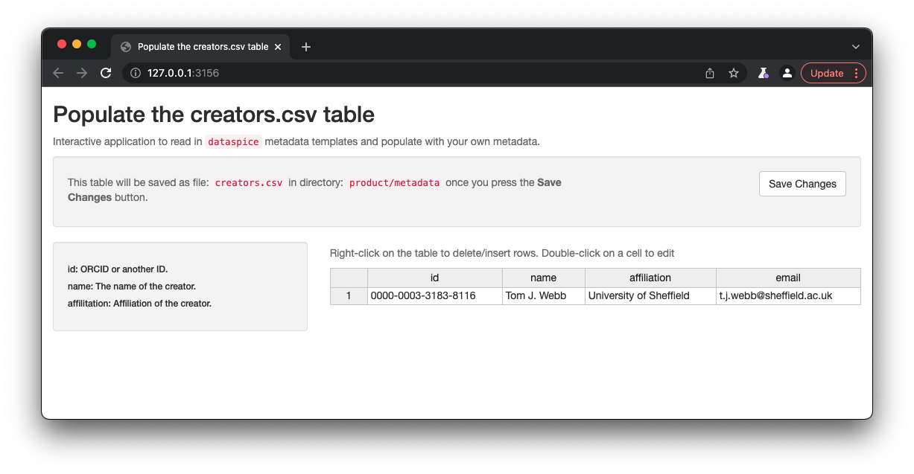
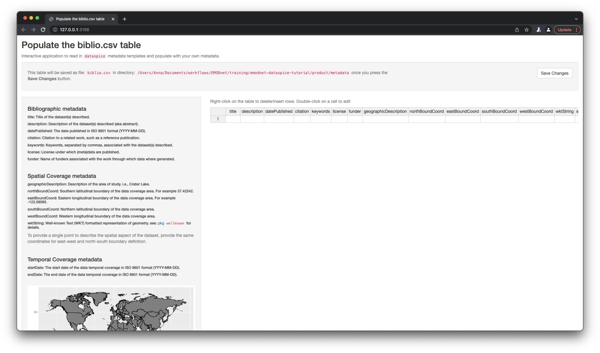
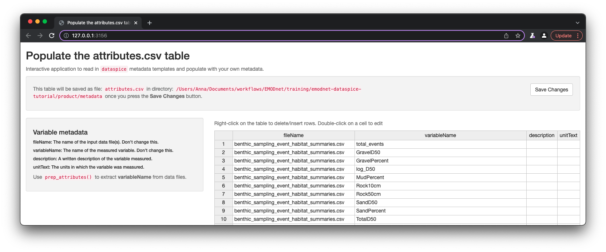
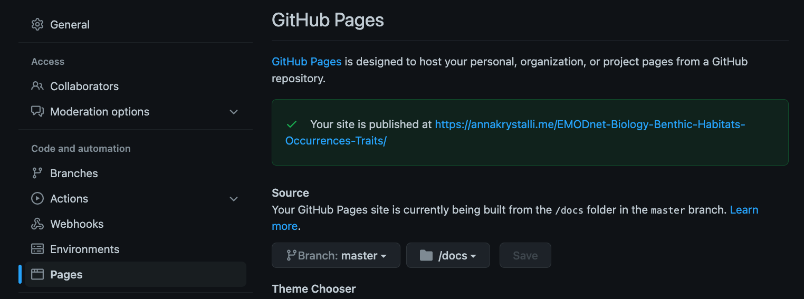
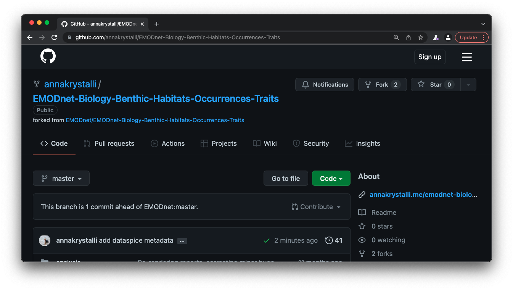

```{r setup, include=FALSE}
knitr::opts_chunk$set(echo = TRUE)

# Learn more about creating websites with Distill at:
# https://rstudio.github.io/distill/website.html

# Learn more about publishing to GitHub Pages at:
# https://rstudio.github.io/distill/publish_website.html#github-pages

```


```{r meta, echo=FALSE}
library(metathis)
meta() %>%
  meta_general(
    description = "EMODnet Biology Dataspice Tutorial",
    generator = "xaringan and remark.js"
  ) %>% 
  meta_name("github-repo" = "annakrystalli/emodnet-dataspice-tutorial") %>% 
  meta_social(
    title = "EMODnet Biology Dataspice Tutorial",
    url = "http://annakrystalli.me/emodnet-dataspice-tutorial/",
    image = "https://github.com/annakrystalli/emodnet-dataspice-tutorial/blob/master/images/EMODnet_coll_all.jpeg?raw=true",
    image_alt = "EMODnet logo",
    og_type = "website",
    twitter_card_type = "summary_large_image"
  )
```

## Overview

The goal of this tutorial is to provide a **practical exercise in creating metadata** for an **example field collected data product** using package [`dataspice`](https://docs.ropensci.org/dataspice/). 

- Understand basic metadata and why it is important.

- Understand where and how to store them.

- Understand how they can feed into more complex metadata objects.


## Preliminaries

### Software Requirements

To follow this tutorial, you will need to have [**a recent version of R**](https://cran.r-project.org/) and ideally [**RStudio Desktop**](https://www.rstudio.com/download) installed.

You will also need to install package  `dataspice` as well as a few additional helper packages.

```{r, eval=FALSE}
install.packages(c("dataspice", "here", "jsonlite", "listviewer"))
```

### Tutorial Materials

You will also need to fork (make a copy of) and clone (download your fork) the example Data Product [**EMODnet/EMODnet-Biology-Benthic-Habitats-Occurrences-Traits**](https://github.com/EMODnet/EMODnet-Biology-Benthic-Habitats-Occurrences-Traits) I will be working with in this tutorial.


## Introduction

### `dataspice` workflow


```{r, out.width="100%", echo=FALSE}
knitr::include_graphics("https://github.com/ropensci/dataspice/raw/main/man/figures/dataspice_workflow.png")
```

### Example materials

The example Data Product I'm working with is [**EMODnet/EMODnet-Biology-Benthic-Habitats-Occurrences-Traits**](https://github.com/EMODnet/EMODnet-Biology-Benthic-Habitats-Occurrences-Traits) and has the following structure:


```r
├── EMODnet_occs_habs.Rproj
├── README.html
├── README.md
├── analysis
│   ├── benthic data habitat matching.Rmd
│   ├── benthic species habitat dashboards.Rmd
│   └── species and traits.Rmd
├── data
│   ├── derived_data
│   └── raw_data
├── docs
│   ├── benthic-data-habitat-matching.html
│   ├── benthic-data-habitat-matching.pdf
│   ├── benthic-species-habitat-dashboards.html
│   ├── benthic-species-habitat-dashboards.pdf
│   ├── species-and-traits.html
│   └── species-and-traits.pdf
├── product
│   ├── benthic_sampling_event_habitat_summaries.csv
│   ├── benthic_specicies_habitat_summaries.csv
│   └── species_hab_plots
└── scripts
    ├── biotic traits data.R
    ├── get_event_habitats.R
    ├── get_species_habitats.R
    ├── get_worms_fgrp.R
    └── plot_species_habitats.R
```

Generally, it is not necessary to document raw or intermediate data files. It **is important to document any outputs or analytical data produced**. 

We therefore focus on the contents of the `product/` directory.

In particular, we will document the following two files:

- **`benthic_sampling_event_habitat_summaries.csv`**
- **`benthic_specicies_habitat_summaries.csv`**


## Create dataspice metadata files

We'll **start by creating the basic metadata `.csv` files** in which to collect metadata related to our example dataset using function **`dataspice::create_spice()`**.

The default behaviour of the function (called without providing a `dir` argument), would create a `metadata` directory in the `data` directory in the root of a project.

However, because I want to document the files in the `product` directory, I override the default write out location by providing a `dir` argument.

```{r, eval=FALSE}
dataspice::create_spice(dir = "product")
```

This **creates a `metadata` directory in the project's `product` directory** containing **4 `.csv` files** in which to record metadata.


```{r, echo=FALSE}
fs::dir_tree("product")
```


- **access.csv**: record details about where your data can be accessed.
- **attributes.csv**: record details about the variables in your data.
- **biblio.csv**: record dataset level metadata like title, description, licence and spatial and temoral coverage.
- **creators.csv**: record creator details.

## Record metadata

### `creators.csv`

> The `creators.csv` contains details of the **dataset creators**.

#### Fields to collect:

- **id:** ORCID or another ID.
- **name:** The name of the creator.
- **affilitation:** Affiliation of the creator.

Let's start with a quick and easy file to complete, the **creators**. We can **open and edit** the file in an **interactive shiny app** using **`dataspice::edit_creators()`**. 

The default behaviour of the function (called without providing a `metadata_dir` argument) will look for a `creators.csv` file in the `data/` directory. However, because we want to override this behaviour, we provide an explicit path for the metadata directory.


```{r}
metadata_dir <- here::here("product", "metadata")
```


```{r, eval=FALSE}
dataspice::edit_creators(metadata_dir = metadata_dir)
```


```{r, out.width="100%", echo=FALSE}

```

Once details are complete, remember to click on **Save** to save the changes to the `creators.csv`.

```{r, out.width="100%", echo=FALSE}

```


### `access.csv`

> The `access.csv` contains details about **where the data can be accessed**.

#### Fields to collect:

- **fileName:** The filename of the input data file(s). 
- **name:** A human readable name for the file.
- **contentUrl:** A url to where the data is hosted, if applicable.

Before manually completing any details in the `access.csv`,  we can use `dataspice`'s  dedicated function **`prep_access()` to extract relevant information** from the data files themselves.


```{r, eval=FALSE}
dataspice::prep_access(data_path = "product", access_path = "product/metadata/access.csv")
```

```
The following fileNames have been added to the access file: benthic_sampling_event_habitat_summaries.csv, benthic_specicies_habitat_summaries.csv
```


Next, we can **use function `edit_access()`** to view and edit the contents of `access.csv`.  


```{r, eval=FALSE}
dataspice::edit_access(metadata_dir)
```
Remember to click on **Save** when you're done editing.

Otherwise, as the files are just csvs, you can edit them in your favourite editor instead. 

<br>


###  `biblio.csv`


> The `biblio.csv` contains dataset level metadata like **title**, **description**, **licence** and **spatial** and **temporal coverage**.

#### Fields to collect:

##### Bibliographic metadata

- **title:** Title of the dataset(s) described.
- **description:** Description of the dataset(s), e.g. the abstract. 
- **datePublished:** The date published in ISO 8601 format"(YYYY-MM-DD).
- **citation:** Citation to a related work, such as a reference publication.
- **keywords:** Keywords, separated by commas, associated with the dataset(s) described.
- **license:** License under which (meta)data are published. Should be CC-BY 4.0 according to EMODnet policy.
- **funder:** Name of funders associated with the work through which data where generated.

##### Spatial Coverage metadata

- **geographicDescription:** Description of the area of study, i.e., Crater Lake.
- **northBoundCoord:** Southern latitudinal boundary of the data coverage area. For example 37.42242.
- **eastBoundCoord:** Eastern longitudinal boundary of the data coverage area. For example -122.08585.
- **southBoundCoord:** Northern latitudinal boundary of the data coverage area.
- **westBoundCoord:** Western longitudinal boundary of the data coverage area.
- **wktString:** Well-known Text (WKT) formatted representation of geometry. see: [pkg `wellknown`](https://ropensci.org/tutorials/wellknown_tutorial/) for details.

_To provide a single point to describe the spatial aspect of the dataset, provide the same coordinates for east-west and north-south boundary definition._

##### Temporal Coverage metadata

- **startDate:** The start date of the data temporal coverage in ISO 8601 format (YYYY-MM-DD).
- **endDate:** The end date of the data temporal coverage in ISO 8601 format (YYYY-MM-DD).


Before we start filling this table in, we can use some base R functions to extract some of the information we require from the data itself. In particular we can **use function `range()` to extract the temporal and spatial extents of our data from columns containing temporal and spatial data.**

Such information is contained in `benthic_abundance_sampling_events_seabed_habs.csv` in the `data/derived_data` directory.

```{r, echo = FALSE, message=FALSE}


sampling_events <- read.csv(here::here("data","derived_data", "benthic_abundance_sampling_events_seabed_habs.csv"))
```


#### Get **temporal extent**

Although dates are stored as a text string, **because they are in ISO format (YYYY-MM-DD), sorting them results in correct chronological ordering**. If your temporal data is not in ISO format, consider converting them (see package `lubridate`)

```{r}
range(sampling_events$datecollected, na.rm = TRUE) 
```

#### Get **geographical extent**

The lat/lon coordinates are in decimal degrees which again are easy to sort or calculate the range in each dimension. 

##### South/North boundaries

```{r}
range(sampling_events$decimallatitude)
```

##### West/East boundaries

```{r}
range(sampling_events$decimallongitude)
```

_NB: you can also supply the geographic boundaries of your data as a single [well-known text string](https://en.wikipedia.org/wiki/Well-known_text) in field `wktString` instead of supplying the four boundary coordinates._


Now that we've got the values for our temporal and spatial extents, we can **complete the rest of the fields in the `biblio.csv` file using function `dataspice::edit_biblio()`**. 

<div class="alert alert-info">

A lot of the rest of the information, I've taken from the data product [**metadata page on the data catalogue**](https://www.emodnet-biology.eu/data-catalog?module=dataset&dasid=6620). Ideally, the workflow would work the other way around, i.e. the data is collected by the data product producer and is then much more easily ingested into the data catalogue.

</div>


```{r, eval=FALSE}
dataspice::edit_biblio(metadata_dir)
```


```{r, out.width="100%", echo=FALSE}

```


### `attributes.csv`

> The `attributes.csv` contains details about the **variables** in your data. This is critical metadata to ensure data is understood and used correctly.

#### Fields to collect:

- **fileName:** The name of the data file(s) the variable is found in.
- **variableName:** The name of the measured variable.
- **description:** A written description of the variable measured.
- **unitText:** The units in which the variable was measured.


Again, `dataspice` provides functionality to **populate the `attributes.csv` by extracting the variable names from our data file** using function **`dataspice::prep_attributes()`**.

The functions is vectorised and maps over each `.csv` file in our `product/` folder and populates the `fileName` and `variableName` columns.


```{r, eval=FALSE}
dataspice::prep_attributes(data_path = "product", 
                           attributes_path = file.path(metadata_dir, "attributes.csv"))
```


```{r, out.width="100%", echo=FALSE}

```


All column names in **`benthic_sampling_event_habitat_summaries.csv`**
- **`benthic_specicies_habitat_summaries.csv`** have been successfully extracted into the `variableName` column of `attributes.csv`.

Now, we can complete the `description` and `unitText` fields using 


```{r, eval=FALSE}
dataspice::edit_attributes(metadata_dir)
```


***Note:*** _Because this is just a demo and I am not an expert in the data, the description is just a more readable version of each variable name and there are no units. This points to the importance of such metadata being produced by someone who is knowledgeable about the data, in order to ensure accuracy of descriptions._


## Create metadata json-ld file

Now that all our metadata files are complete, we can **compile it all into a structured `dataspice.json` file** in our `product/metadata/` folder. 

```{r, eval=FALSE}
dataspice::write_spice(metadata_dir)
```

This function takes all the information collected in the csv files and compiles it into a json-ld, whose structure is compliant with schema.org dataset metadata standard.


**Publishing this file on the web means it will be indexed by Google Datasets search!** `r emo::ji("smiley")` `r emo::ji("+1")` 

#### Making use of the metadata in `dataspice.json`

Generating the `dataspice.json` file means we now have all our metadata in a standardised, interoperable, machine readable format allowing to build further automation from it.

##### Reading into R

We can for example, load it into R and review it:

```{r}
dataspice_lst <- jsonlite::read_json(file.path(metadata_dir, "dataspice.json"))

listviewer::jsonedit(dataspice_lst)
```

##### Presenting metadata in Rmarkdown

We could also have a standard markdown snippet the extracts metadata from the `dataspice.json` file and include it in a README.Rmd.

For example, the following snippet in an Rmd document:

```{r, results='asis', eval=FALSE}
### `r dataspice_lst$name`

##### Creator: `r dataspice_lst$creator[[1]]$name`

#### Data Product Description:

`r dataspice_lst$description`
```


would render to the following in the html/md version:

<div class="box-shadow">


### `r dataspice_lst$name`

##### Creator: `r dataspice_lst$creator[[1]]$name`

#### Data Product Description:

`r dataspice_lst$description`


</div>


<br>

***

## Build README site

Finally, we can **use the `dataspice.json` file** we just created to **produce an informative README web page** to include with our dataset for humans to enjoy! `r emo::ji("star_struck")`

We use function **`dataspice::build_site()`** which **creates file `index.html`** in the `docs/` folder of your project (which it creates if it doesn't already exist).


```{r, eval=FALSE, echo=FALSE}
dataspice::build_site(path = file.path(metadata_dir, "dataspice.json"),
                      out_path = file.path("dataspice/index.html"))
```

```{r, eval=FALSE}
dataspice::build_site(path = file.path(metadata_dir, "dataspice.json"))
```

<br> 

### Enable GitHub Pages to serve the metadata webpage

In the repository **Settings** page, select the **Pages** tab on left hand navigation panel.

To enable GitHub pages, select the branch (`master`) and folder (`docs/`) containing the content to be served:

```{r, out.width="100%", echo=FALSE}

```

It's useful practice to add the url on the front matter of the repository:

```{r, out.width="100%", echo=FALSE}

```

### View the resulting served `index.html` file [online](https://annakrystalli.me/EMODnet-Biology-Benthic-Habitats-Occurrences-Traits/)

<br>

Here's a screen shot!

<div class="box-shadow">

```{r, out.width="100%", echo=FALSE}
knitr::include_url("dataspice/index.html")
```

</div>


### Completed metadata files

- [`access.csv`](https://github.com/annakrystalli/EMODnet-Biology-Benthic-Habitats-Occurrences-Traits/blob/master/product/metadata/access.csv)
- [`attributes.csv`](https://github.com/annakrystalli/EMODnet-Biology-Benthic-Habitats-Occurrences-Traits/blob/master/product/metadata/attributes.csv)
- [`biblio.csv`](https://github.com/annakrystalli/EMODnet-Biology-Benthic-Habitats-Occurrences-Traits/blob/master/product/metadata/biblio.csv)
- [`creators.csv`](https://github.com/annakrystalli/EMODnet-Biology-Benthic-Habitats-Occurrences-Traits/blob/master/product/metadata/creators.csv)

See the [**whole repository**](https://annakrystalli.me/EMODnet-Biology-Benthic-Habitats-Occurrences-Traits/)
